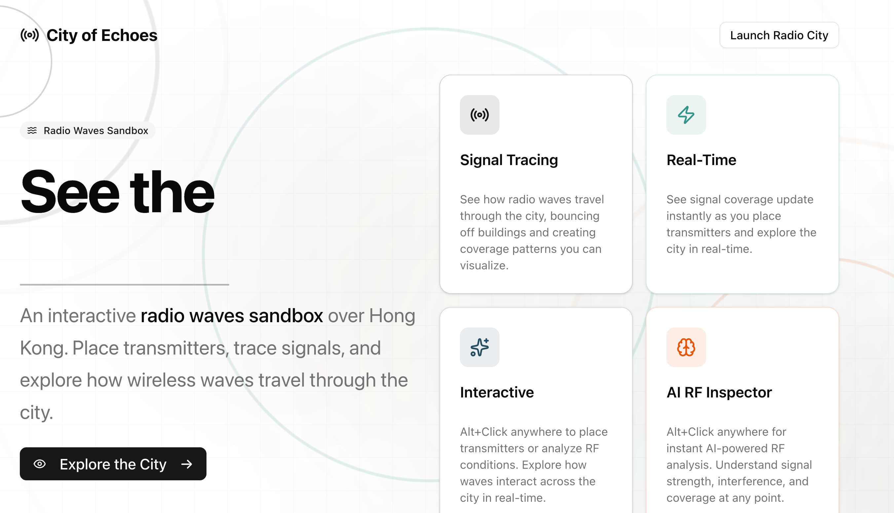
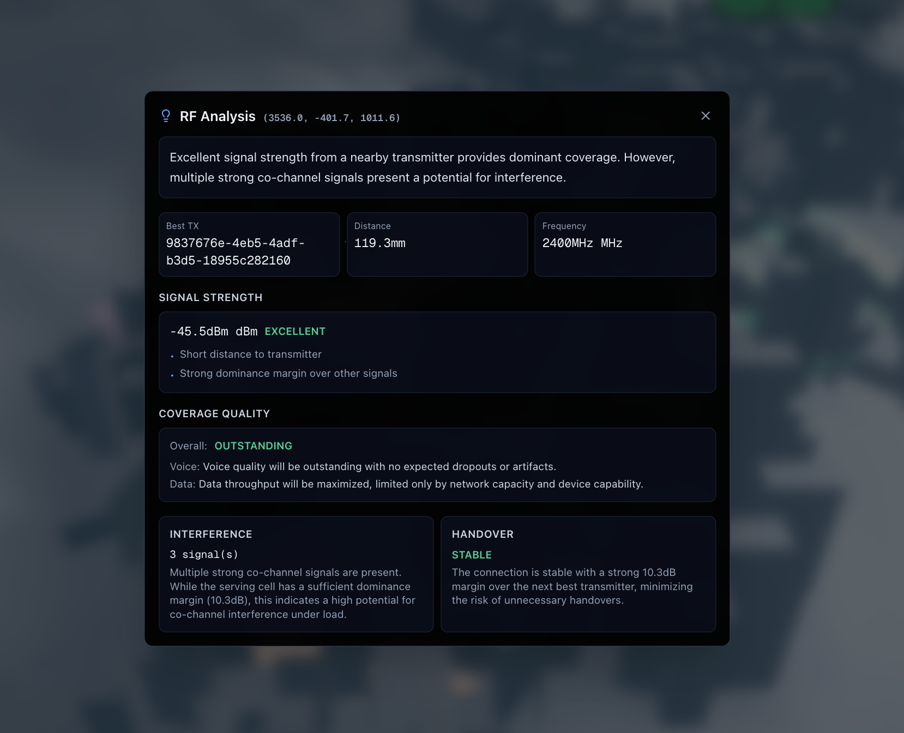

# City of Echoes — Radio Weather for Hong Kong

Interactive RF propagation sandbox built for the **Junction 2025 – Sensofusion "Radio City" challenge**. The experience renders Hong Kong’s skyline in 3D, lets you drop moving transmitters, and shows interference and drive-test quality in real time.



Live demo: **http://entropyvision.vercel.app/**

Full technical write-up: [`docs/SOLUTION.md`](docs/SOLUTION.md)

---

## What You Can Do

- **GPU interference field** – A fragment shader computes constructive/destructive wave patterns from up to eight transmitters.
- **Ray-traced propagation** – Each source launches hundreds of Fibonacci-sampled rays with material-aware reflections, FSPL loss, and power budgets tracked to −110 dBm.
- **Path/drive testing** – Shift+Click to lay out waypoints, animate a probe vehicle, color the path by signal strength, and drop handover markers when the best serving cell changes.
- **AI RF Inspector** – Alt+Click anywhere to capture local RF metrics and ask Google Gemini (via `@ai-sdk/google`) for a structured summary of coverage, interference, and handover stability.
- **Responsive controls** – WASD flight camera on desktop, long-press gestures for mobile, and HUD toggles for rays, interference, and the path tool.




---

## Controls

- `Alt+Click` / long-press — Add a transmitter or request AI analysis.
- `Shift+Click` — Append a waypoint while Path Builder is enabled.
- `WASD`, `Q/E`, `Space/Ctrl` — Navigate the scene.
- HUD toggles — Enable/disable rays, interference field, and drive-test overlay.

---

## Architecture Snapshot

- **Scene:** Next.js 16 + React 19 with React Three Fiber, Drei helpers, and BVH-accelerated GLTF loading of `public/hk_compressed.glb`.
- **Propagation:** Custom ray builder with multi-bounce reflections, semantic material tagging, and instanced meshes for ray particles.
- **Visualization:** GLSL shader for interference, pulsing wavefront meshes, bloom/vignette/film-grain post-processing, and HUD overlays built with shadcn/ui.
- **AI Endpoint:** `app/api/explain-rf/route.ts` computes FSPL metrics client-side and calls Gemini 2.5 Pro through `generateObject` to produce structured RF insights.


More implementation details live in `docs/SOLUTION.md`.

---

## Getting Started

```bash
npm install

cp .env.example .env.local
# Add GOOGLE_GENERATIVE_AI_API_KEY (or compatible key for @ai-sdk/google)

npm run dev
```

The GLB city model is expected at `public/hk_compressed.glb`, and DRACO decoders are streamed from Google's CDN.

---

## Tech Stack

- Framework: Next.js 16 (App Router), React 19, TypeScript
- 3D: Three.js 0.181, @react-three/fiber, @react-three/drei, @react-three/postprocessing
- UI: Tailwind CSS, shadcn/ui, Lucide icons
- AI/Server: `@ai-sdk/google`, `ai`, Zod, Edge-capable Next.js route handlers

---

## Challenge + Team

- **Challenge:** Sensofusion – Radio City (Junction 2025: Utopia & Dystopia)
- **Team:** City of Echoes
- **Team Lead:** Carl Kugblenu

---

Explore the full technical write-up in `docs/SOLUTION.md` and the live experience at http://entropyvision.vercel.app/.
